# Práctica 1 - Configuración de máquina virtual en el IaaS
* * *
**Desarrollo en Sistemas Informáticos**

* Nombre: Héctor Rodríguez Alonso.
* Fecha: 2022-02-20.
* Alu: alu0101365107.

* * *
# Indice
* [Configuracion](#configuracion)

## Configuracion
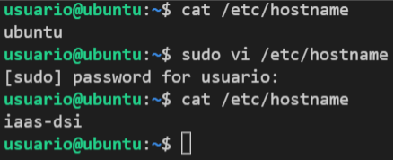
1. Encendido y visualización de la IP de la VPS
    * Deberemos de acceder al  y tomar nuestra máquina, encenderla y esperar a que esté encendida. Acto seguido entramos a la consola por navegador y ejecutamos el siguiente comando:\n ```ifconfig -a```

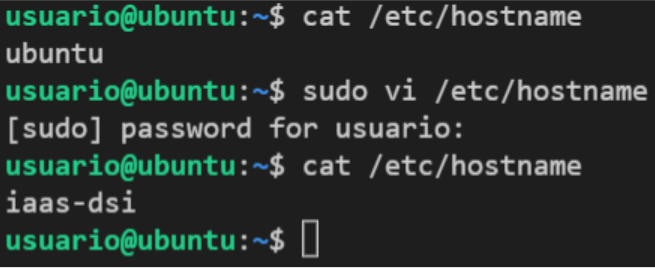
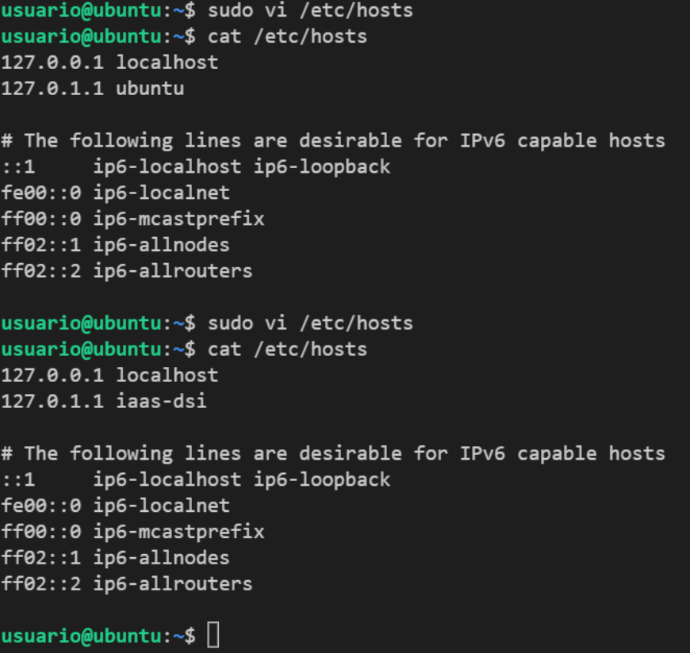
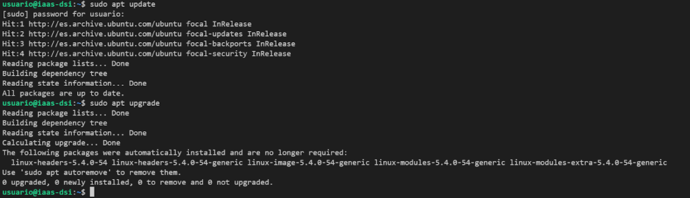
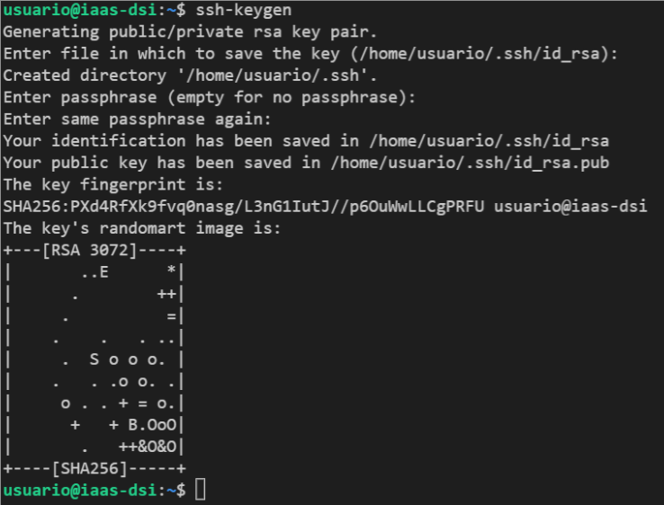
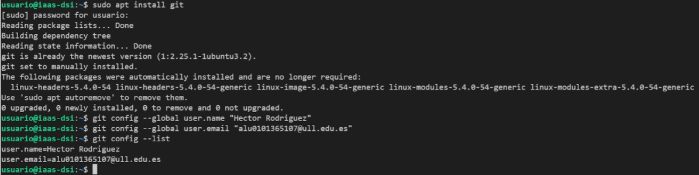
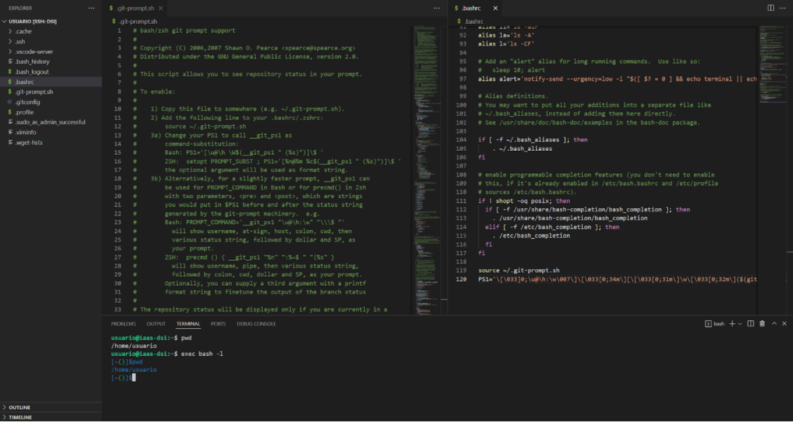

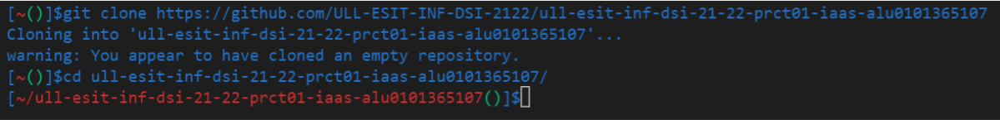
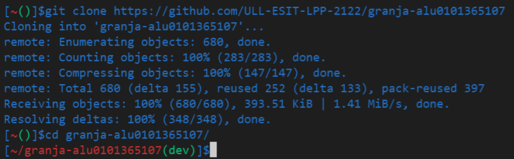

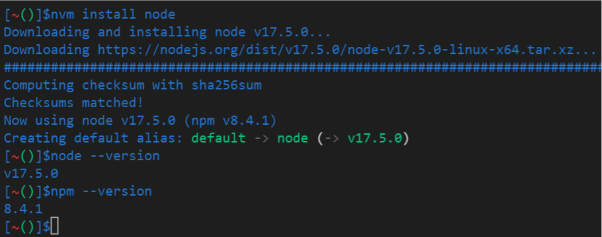
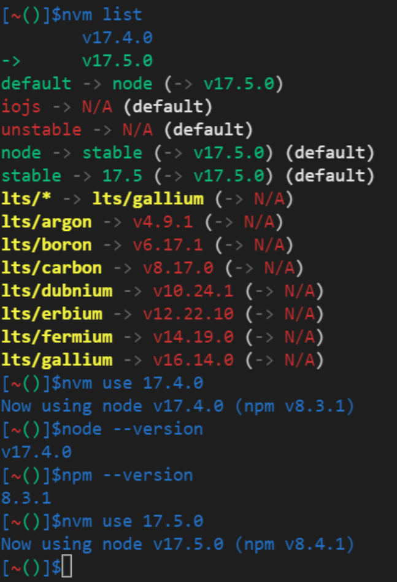


Cambio en el hostname