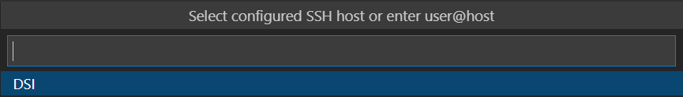

# Práctica 1 - Configuración de máquina virtual en el IaaS
* * *
**Desarrollo en Sistemas Informáticos**

* Nombre: Héctor Rodríguez Alonso.
* Fecha: 2022-02-20.
* Correo: alu0101365107@ull.edu.es.

* * *
# Indice
* [Configuración](#configuracion-previa)
* [Instalación](#Instalación-de-git-y-Node.js)

## Configuracion previa

1. __Encendido y visualización de la IP de la VPS__
    * Deberemos de acceder al [IAAS](https://iaas.ull.es/ovirt-engine/sso/login.html) y tomar nuestra máquina, encenderla y esperar a que esté operativa.
    * Una vez la VPS este ejecutándose correctamente, accedemos a ella mediante la consola VNC en explorador y nos validaremos, una pasado hecho esta pedirá que cambiemos la contraseña. 
    * Al finalizar los pasos anteriores, nos tendremos que volver a validar y deberemos de ejecutar el siguiente comando: ```ifconfig -a```.
    
2. __Configuración del SSH en VSCODE__
    * Crearemos una nueva conexión con Remote-SSH ejecutando ```ssh usuario@10.6.130.7```
    * Editaremos el fichero config de Remote-SSH y añadiremos ```Host DSI```, para así no tener que acordarnos de la IP siempre. Quedaría de la siguiente forma:  
    ```
        Host DSI
            HostName 10.6.130.7
            User usuario
    ```
    * Comprobaremos que poseemos la siguiente opción a la hora de hacer el connect a la VPS.
    
    > De esta forma solo tendremos que poner la contraseña cada vez que accedamos o tengamos que cambiar de directorio en el menú propio de VSCODE.
    >
3. __Configuración básica de la VPS__
    * Visualizaremos el hostname de la VPS mediante ```cat /etc/hostname``` y modificaremos _ubuntu_ por _iaas-dsi_ con ```sudo vi /etc/hostname```, una vez hecho, verificamos el cambio con el primer comando usado.
    
    * Visualizaremos el nombre del host mediante ```cat /etc/hosts``` y modificaremos _ubuntu_ por _iaas-dsi_ este con ```sudo vi /etc/hosts```, verificamos el cambio con el primer comando usado. 
    
4. __Actualización de la VPS y generación de la RSA__
    * Lanzaremos los siguientes comandos ``` sudo apt update``` y ```sudo apt upgrade```
    
    * Mediante el comando ```ssh-keygen``` obtendremos una RSA, la cual utilizaremos más adelante.
    
5. __Instalación y configuración de Git__
    * Mediante el comando ```sudo apt install git``` instalaremos el paquete de Git
    * Una vez instalado el paquete, deberemos de configurar el usuario y correo de nuestra cuenta de GitHub al paquete. Para ello usaremos ```git config --global user.name " "``` donde colocaremos nuestro nombre y ``` git config --global user.mail``` colocando el correo. Usaremos la flag _--global_ para no tener que estar configurando este en cada proyecto donde usemos Git.
    

## Configuración del SSH de GitHub con nuestra VPS y cambio en el estilo de la Terminal


## Instalación de git y Node.js


Cambio en el hostname